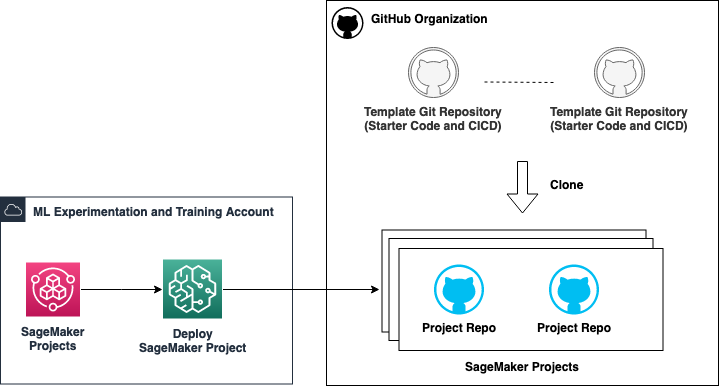

# Template Repos

The seed code for GitHub template repositories. Make sure you have a template for each of the 5 repos here in your GutHub Organization.

Templates:

1. [model-training](./model-training/):
2. [model-deployment-realtime](./model-deployment-realtime/)
3. [model-deployment-batch](./model-deployment-batch/)
4. [container-build](./container-build/)
5. [pipeline-promotion](./pipeline-promotion/)
6. [llm-training](./llm-training/)

> **_Note:_** Make sure to mark these repositories as a template on GitHub.